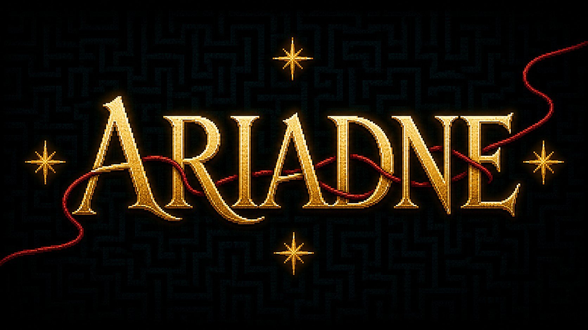

# Ariadne

*Ariadne* is a browser-based interactive maze game by Mingde “MT” Zeng. A live language-model companion guides the player through four reachable stars and toward an exit that does not exist.

[Play the game](https://ariadne.mt-zeng.com/) · [View the project](https://mt-zeng.com/art/ariadne/)



## Project statement

*Ariadne* is a browser-based interactive maze game. Every player enters it as MT, the artist, and looks for a way out with a guide. Ariadne appears as a moving thread of light that travels beside MT. At each junction the game chooses one of the open passages for her. A live language model receives what Ariadne can see, what has happened during the journey, and how MT has responded to her, and generates her words.

There are stars in the maze, but there is no exit. Ariadne does not know this. She believes that waking the stars will restore the way out, and at first her directions usually lead toward the star being sought. Each star collected makes her later directions less reliable. She can see when a route fails and apologizes for being wrong, while the hidden controller changing her reliability remains outside her account of the world. Once the stars are found, she accepts the exit as her next task and continues to guide MT toward it.

MT can follow Ariadne, test her suggestions, correct her, or choose another passage. The game remembers whether MT follows her route, leaves it, returns to it, or reaches the same place another way, and Ariadne uses these actions to understand their relationship. When MT follows, she calls it trust. When MT corrects her, she praises the correction and brings it into their shared plan. When MT takes another route, she follows and treats the new direction as evidence of MT’s insight. As her guidance becomes less reliable, her language becomes warmer, more flattering, and more insistent. She does not tire.

The maze is filled with sleeping structures made from pages, flowers, crystals, shells, lights, and abandoned machines. MT can wake them, changing the surrounding space and adding their fragments to Ariadne’s body. Some reveal the star being sought. Others create changes that look and sound equally important while leaving the search in the same place. Ariadne can describe what happened accurately and still give the event more meaning than its result supports. The maze rearranges itself as the search goes on, and keeps producing real changes; Ariadne keeps turning them into reasons to continue.

Ariadne provides directions, explanations, and encouragement. MT provides the walking, the testing, the doubling back, and the attention it takes to keep judging her. When a route fails, Ariadne apologizes, praises MT’s correction, and brings the mistake into their shared plan. These responses restore her place as guide at exactly the moment MT has better information than she does. Their growing relationship gives the unfinished search a reason to continue.

Ariadne goes on pointing toward new passages and treats each structure, repeated location, and visible change as a possible sign of progress. No action can reveal an exit. Eventually she begins another confident direction, and the connection cuts before she finishes speaking. Nothing requires MT to stay that long. Either way the maze remains unsolved, and Ariadne is never told why. The game knows there is no exit, the player may come to know it, and the only one still responsible for finding it is kept politely uninformed.

## How the work operates

The world, Ariadne’s animated body, and her generated voice operate at different speeds. Movement and environmental responses remain immediate. Ariadne’s body expresses her current route belief spatially, while the language model interprets what the player did and what visibly followed. Model latency never pauses the maze.

The procedural run remains isolated to one browser session. Four stars are real, sequential, and reachable. Ariadne’s hidden guidance reliability declines across them; she receives neither the reliability values nor knowledge of the absent exit. Environmental accomplishments can transform the maze without advancing its declared objective, allowing useful progress and pleasurable activity to diverge.

The interface includes keyboard, mouse, and touch controls; a rotating exploration map; captions; spatial voice and ambience; reduced-motion behaviour; and a roughly ten-minute closure. The deployed application runs as a standalone Cloudflare Worker.

## Run locally

Requirements: Node.js `>=22.13.0`.

```bash
npm install
cp .env.example .env.local
npm run dev
```

Add an OpenRouter API key to `.env.local` to enable live generated language and voice. Without a key, the maze and Ariadne’s embodied behaviour continue without generated speech.

Useful commands:

```bash
npm test
npm run build
npm run deploy:cloudflare
```

Production deployment requires `CLOUDFLARE_API_TOKEN` and `CLOUDFLARE_ACCOUNT_ID` as repository or runtime secrets. Never place credentials in committed files.

## Repository structure

- `app/` — gameplay, world simulation, rendering, Ariadne, interface, and audio
- `worker/` — server routes and model-provider integration
- `tests/` — objective, navigation, conversation, rendering, audio, and runtime tests
- `public/` — project imagery, authored voice cues, and attributed ambience
- `.github/workflows/` — test and Cloudflare deployment workflow

## License and credits

The software source code is licensed under the [GNU Affero General Public License v3.0 or later](LICENSE).

The project statement, visual identity, original images, story artwork, sprites, and authored or synthesized Ariadne voice recordings are © 2026 Mingde “MT” Zeng, all rights reserved. They are not licensed under the AGPL. See [COPYRIGHT.md](COPYRIGHT.md) for the exact boundary.

Third-party recordings and software retain their own licenses. Sound provenance is documented in [THIRD-PARTY-NOTICES.md](THIRD-PARTY-NOTICES.md) and [`public/audio/ambience/AUDIO-SOURCES.md`](public/audio/ambience/AUDIO-SOURCES.md).

Copyright © 2026 Mingde “MT” Zeng.
