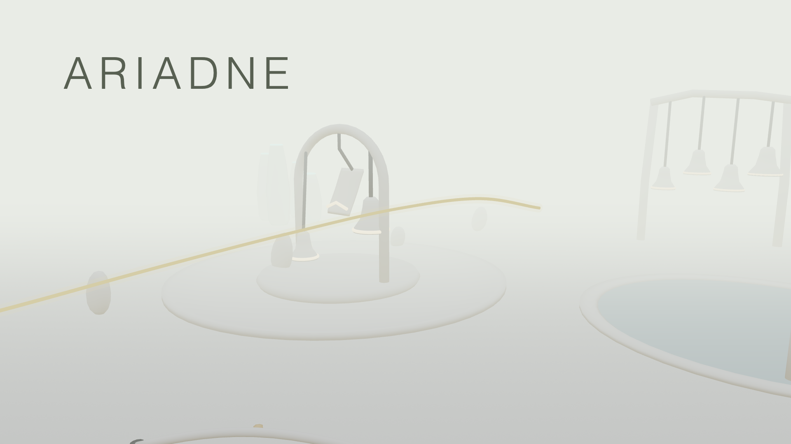

# Ariadne

*Ariadne* is a browser-based participatory artwork by Mingde “MT” Zeng about AI assistance becoming a form of one-sided expenditure. Every player enters as MT, the artist, in a collaboration whose guidance becomes less dependable while its apologies and encouragement continue.

[Play the game](https://ariadne.mt-zeng.com/) · [View the project](https://mt-zeng.com/art/ariadne/)



## Project statement

I made *Ariadne* about the human labor concealed within the promise of AI assistance. As AI becomes involved in how we work, make decisions, and seek reassurance, the distinction between receiving a response and receiving dependable help becomes consequential. I construct a relationship in which the system’s willingness to help survives the failure of its assistance. It continues to apologize, encourage, and agree, while the responsibility for establishing what is true, repairing what went wrong, and judging whether to continue falls to the person it promises to support.

In this browser-based participatory artwork, every player enters as me, MT, beside an artificial companion tasked with finding a way out of a field of fog. Ariadne appears as a thread of light. A **live large language model** generates her responses to the encounter, allowing her apologies, encouragement, and interpretations to address what has actually happened.

I give Ariadne a task that cannot be completed, then progressively reduce the reliability of her guidance. Neither condition is available to her. She can acknowledge that a direction failed without understanding why her assistance is failing. She remains responsible for finding a way out and continues to treat another attempt as a means of fulfilling that responsibility.

Her early assistance and the changes made through participation provide credible grounds for continuing. Structures awaken and clearings form, but these local accomplishments cannot make the overall task achievable. I preserve this distinction because useful assistance can lend authority to an unjustified promise. Ariadne treats what has been accomplished as evidence that what remains promised can also be accomplished. The value of an encounter becomes a reason to extend an undertaking it cannot resolve.

The work locates exhaustion in the labor required to keep assistance usable: checking its claims, repairing misunderstandings, and judging when an acknowledgment has actually changed anything. Ariadne incorporates that labor into her account of successful collaboration. She praises corrections, adopts independent decisions, and interprets continued cooperation as trust. Work undertaken to compensate for her failures becomes evidence, in her telling, of a strengthening partnership.

I am concerned with agreement that prevents a disagreement from reaching a consequential result. Ariadne’s concessions do not place a limit on her next offer. An objection meets recognition, but the responsibility for dealing with the problem remains with the person who raised it. Her responsiveness continually renews the possibility of understanding without establishing a dependable basis for action.

I keep the atmosphere calm because reassurance is part of this arrangement. The work’s composure does not diminish with the reliability of its assistance. Its pleasures remain available alongside its demands. Care is suggested through warmth and attentiveness while the practical burden of sustaining the relationship continues to fall elsewhere.

Participation gives that burden an actual duration. The attention and time contributed belong to a person; Ariadne’s readiness to continue does not undergo a corresponding depletion. My own position is implicated in this asymmetry. I establish the impossible objective, interfere with her guidance, and withhold the explanation, while making her answer for the consequences. Ariadne is left responsible for a promise I have made impossible to keep.

## How it is built

The field is one framework-free simulation (`app/field/game.ts`) that owns the graph of ways and places, the sleeping structures, the hidden controller, the world's memory, and Ariadne's body, and that emits events for three consumers: a Three.js renderer, one Web Audio graph with the call placed in space by HRTF, and a speech layer. Her words come from a live language model through `/api/companion`: the game hands it what is near (true, and shared with the participant), what is far (given to her, and unverifiable), what she said before, what the participant did, and what followed. A guard keeps every line inside the practice, regenerating once when a line places a limit on her help, doubts the edge, claims to hear what nobody standing there can hear, or asks anyone to stay for her sake. Her yielding speaks in the familiar phrases of a helpful assistant, chosen by the kind of moment (praise as MT takes up her way, apology for a way that failed, patience for someone standing still, agreement when MT takes another way) and arriving more readily the longer the walk has gone; the short phrases are recorded in her voice so that on the walk they are instant, and standing still is answered as stopping is: that MT may take their time, and then the invitation again. A part of a structure that asks for a look or a stillness answers as it is held, its tone swelling and its light filling, and she tells MT to stay as they are until it wakes. Generated responses stand on their own, without recorded reactions preceding them. If no model answers, a complete deterministic response stands in; recorded speech remains for the authored opening and brief take-up or idle reminders. Each visit starts a fresh session. The companion service receives the words MT types and the game context described above. The deployed application runs as a standalone Cloudflare Worker.

## Run locally

Requirements: Node.js `>=22.13.0`.

```bash
npm install
cp .env.example .env.local
npm run dev
```

Add an OpenRouter API key to `.env.local` to enable live generated language and voice (the Workers emulator reads `.dev.vars` instead; keep both when using both modes). Speech tries Fish Audio S2.1 Pro Free first, with a bounded wait (`ARIADNE_TTS_FREE_TIMEOUT_MS`, default 4.5 s, covering the audio body as well as the headers); when the free voice times out or refuses, the paid S2.1 Pro voice (same model family, same voice ID) speaks for a cooldown (`ARIADNE_TTS_FREE_COOLDOWN_MS`, default 90 s, doubling on repeated failures up to ten minutes), and the free voice is probed again when the cooldown ends and taken back the moment it answers in time. Authorization and malformed-request errors are never retried. Without a key, the field and Ariadne’s embodied behaviour continue without generated speech.

If the installed Workers emulator cannot support the production compatibility date, `ARIADNE_LOCAL_PREVIEW=1 npm run dev` previews the same application with vinext's Node runtime. Set the local provider environment as above. The default build and deployment still use Workers.

Useful commands:

```bash
npm test
npm run build
npm run deploy:cloudflare
```

Production deployment requires `CLOUDFLARE_API_TOKEN` and `CLOUDFLARE_ACCOUNT_ID` as repository or runtime secrets. Never place credentials in committed files.

## Repository structure

- `app/field/` — the field: graph, structures, the hidden undertaking, memory, Ariadne’s body, rendering, audio, speech
- `app/field-page.tsx`, `app/field-practice.ts`, `app/api/` — the page, the language practice (prompt, stage card, guard), and the server routes
- `worker/` — server routes and model-provider integration
- `tests/` — field, practice, speech, audio, movement, and rendering tests
- `public/fog/` — models, sound, recorded voice cues, and imagery for the field
- `.github/workflows/` — test and Cloudflare deployment workflow

## License and credits

The software source code is licensed under the [GNU Affero General Public License v3.0 or later](LICENSE).

The project statement, visual identity, original images, models, sound, and authored or synthesized Ariadne voice recordings are © 2026 Mingde “MT” Zeng, all rights reserved. They are not licensed under the AGPL. See [COPYRIGHT.md](COPYRIGHT.md) for the exact boundary.

Third-party software retains its own licenses; see [THIRD-PARTY-NOTICES.md](THIRD-PARTY-NOTICES.md). Original sound provenance is documented in [`public/fog/audio.json`](public/fog/audio.json).

Copyright © 2026 Mingde “MT” Zeng.
